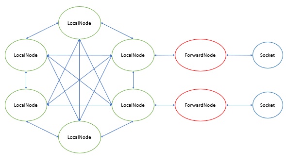
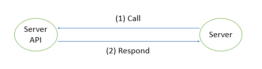
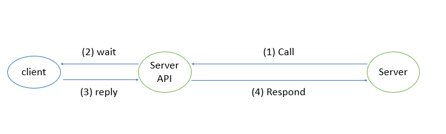
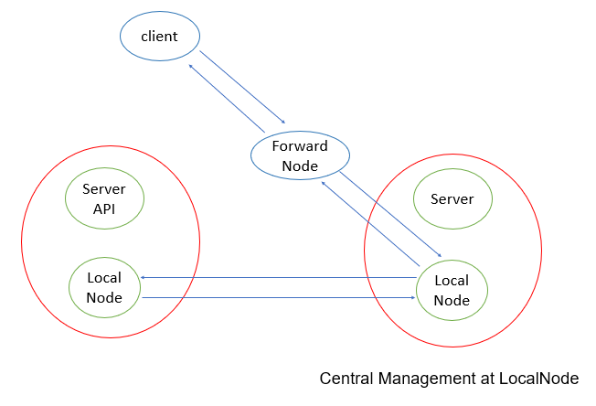

# LocalVNetwork
Transform your program to multiple of entity and connect them together via a Virtual Network simulator



# Problems
You are wanting to call a method of object A in object B, it is easy to archive by including the object A in object B then call the method of its.



Example in Python:
<details>
<summary> Show code </summary>  

```Py
class ServerAPI:
    def respond(self, client, message):
        if message == "GET":
            client.send(b"You are getting")
        elif message == "POST":
            client.send(b"You are posting")

# Server object call a method of ServerAPI object 
class Server:
    def __init__(self, serverapi):
        self.serverapi = serverapi

    def serve(self, client):
        while True: 
            data = client.recv().decode()
            serverapi.respond(client, data)
```
</details>

But what will happen if the method take a long time to respond? Method serve() of class Server in above code have to wait for respond() to finish before serve another request from client.  


Example in Python: 
<details> 
<summary> Show code </summary>  

```Py
class ServerAPI:
    def connect(self, client, another_client):         
        data = another_client.recv() # waiting ...
        if data == b"accept":
            return True
        else:
            return False

# Server object call a method of ServerAPI object 
class Server:
    def __init__(self, serverapi):
        self.serverapi = serverapi

    def serve(self, client):
        while True: 
            data = client.recv().decode()
            if "$connect" in data:
                another_client = extract(data)
                success = serverapi.connect(client, another_client)  # --> waiting ...
                if success:
                    client.send(b"Connection was successful")
                else:
                    client.send(b"Connection failed")
            elif ...
```
</details>

You want to respond any request from the client continously without delay, don't you?

You want to serve another request from the client while the method connect() is in progress, right?

The LocalVNetwork will help you.

# Solution
LocalVNetwork provide 2 class:
+ LocalNode
+ ForwardNode  

The LocalNode can connect to another LocalNode via a channel.


Example in Python:
<details>
<summary> Show code </summary>  

```Py
class ServerAPI:
    def __init__(self):
        self.node = LocalNode()
    
    def wait_from_node(self): # run in thread-3
        while True:
            from_node, message = self.node.recv()
            if "$connect" in message:
                client = extract_from_node(from_node)
                another_client = extract_from_message(message)

                result = self.connect(client, another_client) # waiting, but not effect to Server
                result = f"$result_connect {result}"

                # send result to node of Server (in thread-2)
                self.node.send(from_node, result)
                    
    def connect(self, client, another_client):         
       data = another_client.recv() # waiting ...
        if data == b"accept":
            return True
        else:
            return False

class Server:
    def __init__(self, serverapi):
        self.serverapi = serverapi
        self.node = LocalNode()

    def serve(self, client): # run in thread-1
        while True: 
            data = client.recv().decode()
            if "$connect" in data:
                # send message to node of ServerAPI (in thread-3) and done, no longer waiting
                self.node.send(self.serverapi.node.name, data)
            elif ...

    def wait_from_node(self, client): # run in thread-2
        while True:
            from_node, message = self.node.recv()
            if "$result_connect" in message:
                if "True" in message:
                    client.send(b"Connection was successful")
                else:
                    client.send(b"Connection failed")
```
</details>

Now, the Server can serve both Node of ServerAPI and socket of client in one method using the ForwardNode.  
ForwardNode is the node which forward packet from socket to node and vice versa.



Example in Python:
<details>
<summary> Show code </summary>  

```Py
class ServerAPI:
    def __init__(self):
        self.node = LocalNode()
    
    def wait_from_node(self): # run in thread-2
        while True:
            from_node, message = self.node.recv()
            if "$connect" in message:
                client = extract_from_node(from_node)
                another_client = extract_from_message(message)

                result = self.connect(client, another_client) # waiting, but not effect to Server
                result = f"$result_connect {result}"

                # send result to node of Server (in thread-1)
                self.node.send(from_node, result)
                    
    def connect(self, client, another_client):         
       data = another_client.recv() # waiting ...
        if data == b"accept":
            return True
        else:
            return False

class Server:
    def __init__(self, serverapi):
        self.serverapi = serverapi
        self.node = LocalNode()

    def serve(self, client): # run in thread-1
        forwarder = ForwardNode(self.node, client) # create channel between node and client socket
        forwarder.start()
        while True:
            from_node, data = client.recv().decode()

            if from_node == forwarder.name and "$connect" in data:
                # send message to node of ServerAPI (in thread-2)
                self.node.send(self.serverapi.node.name, data)

            elif from_node == self.serverapi.node.name and "$result_connect" in message:
                if "True" in message:
                    client.send(b"Connection was successful")
                else:
                    client.send(b"Connection failed")
            elif ...
```
</details>

# TESTING
```
# Step 1
$ git clone https://github.com/huykingsofm/LocalVNetwork

# Step 2
# Let's move or copy __server__.py and __client__.py from LocalVNetwork to current directory
# Example:
# Before moving
#    -- CurrentDir/
#    ------ LocalVNetwork/
#    ---------- __server__.py
#    ---------- __client__.py
#    ---------- otherfiles...
# After moving
#    -- CurrentDir/
#    ------ __server__.py
#    ------ __client__.py
#    ------ LocalVNetwork/
#    ---------- otherfiles...

# Step 3
$ python __server__.py

# Step 4
$ python __client__.py
```

# USAGE

```
$ git clone https://github.com/huykingsofm/LocalVNetwork
# Your current working directory like as
# -- CurrentDir/
# ------ main.py
# ------ LocalVNetwork/
# ------ otherfiles.py
```

```Python
# In main.py
from LocalVNetwork import LocalNode, ForwardNode, STCPSocket
# or
from LocalVNetwork import * # See ./LocalVNetwork/__init__.py 
```

## LocalNode
<details> 
<summary> Click to see details </summary>

### @Constructor
```Py
def __init__(self, name: str = None)
```
Create a node in LocalVNetwork system.

**Parameters**
* `name`: the identifier of node, if `name` is `None`, a random name is assign to node.

### @Method
```Py
def send(self, received_node_name: str, message, obj = None)
```
Send a message to another `LocalNode`.  

**Parameters**
* `received_node_name`: the identifier of received node.  
* `message`: the sent data in bytes object.
* `obj`: the attach object.

**Return**  
No return.

### @Method
```Py
def recv(self)
```
Receive a message from another node.

**Parameters**  
No parameter.

**Return**  
A tuple contains:
* `source`: the source node's name of message.  
* `message`: the received message.
* `obj`: the attach object

</details>

## ForwardNode
<details> 
<summary> Click to see details </summary>

### @Contructor
```Py
def __init__(self, node: LocalNode, socket: STCPSocket, name:str = None, verbosities: tuple = ("error", ))
```
Create the channel between a `LocalNode` and a `STCPSocket` and forward them each other.  

**Parameters**
* `node`: the `LocalNode`.  

* `socket`: the `STCPSocket`.  

* `name`: identifier of `ForwardNode`, same the `LocalNode`.  

* `verbosities`: the tuple which each element is in `"error"`, `"warning"` or `"notification"`.
### @Method
```Py 
def start(self)
```
Start the forwarder.

**Parameters**  
No parameter.

**Return**  
No return.

</details>

## STCPSocket
A socket of Transport Control Protocol (TCP) with encrypted payload.  
Almost all methods are the same with built-in `socket.socket`. 

<details> 
<summary> Click to see details </summary>

### @Constructor
```Py
def __init__(self, cipher = Cipher.NoCipher(), buffer_size = 1024, verbosities: tuple = ("error", ))
```
**Parameters**
+ `cipher`: the object of subclass of [_Cipher](./Cipher.py).
+ `buffer_size`: the maximum size of received packet.
+ `verbosities`: the tuple which each element is in `"error"`, `"warning"` or `"notification"`.

### @Method
```Py
def recv(self, reload_time = 0.3)
```
Receive a packet from remote

**Parameters** 
+ `reload_time`: the time (in second) which the socket wait if no packet is in buffer currently.

**Return**
A bytes object as received packet.

### @Methods
```Py
def send(self, data)
```
See [send](https://docs.python.org/3/library/socket.html#socket.socket.send).

```Py
def sendall(self, data)
```
See [sendall](https://docs.python.org/3/library/socket.html#socket.socket.sendall).

```Py
def bind(self, address)
```
See [bind](https://docs.python.org/3/library/socket.html#socket.socket.bind).

```Py
def listen(self)
```
See [listen](https://docs.python.org/3/library/socket.html#socket.socket.listen).  

```Py
def accept(self)
```
See [accept](https://docs.python.org/3/library/socket.html#socket.socket.accept).

```Py
def connect(self, address)
```
See [connect](https://docs.python.org/3/library/socket.html#socket.socket.connect). 

```Py
def close(self)
```
See [close](https://docs.python.org/3/library/socket.html#socket.socket.close).  

</details>

## _Cipher (and its subclass)
Subclass of `_Cipher` are `NoCipher`, `XorCipher`, `AES_CTR` and `SimpleSSL`.

<details>
<summary> Click to see details </summary>

### @Constructor
```Py
# NoCipher
def __init__(self)
```
**Paramters**  
Don't pass any parameter

```Py
# XorCipher and AES_CTR
def __init__(self, key)
```
**Parameters**
+ `key`: the key of cipher.

```Py
# SimpleSSL
def __init__(self, cipher, hash_func)
```
**Parameters**
+ `cipher`: the object of subclass of `_Cipher` (except this class).
+ `hash_func`: the class in module `hashlib`.

### @Method
```Py
def reset_key(self, newkey)
```
Reset the key of cipher.  
**Paramters**
+ `newkey`: newkey of that cipher in bytes object.

**Return**  
No return.

### @Method
```Py
def encrypt(self, plaintext, finalize = True)
```
Encrypt plaintext.  
**Parameters**
+ `plaintext`: the plaintext in bytes object.
+ `finalize`: finish the encrypt process (add padding or something, corresponding to cipher type).

**Return**  
The ciphertext in bytes object.

### @Method
```Py
def decrypt(self, ciphertext, finalize = True)
```
Decrypt cipher.  
**Parameters**
+ `ciphertext`: the ciphertext in bytes object.
+ `finalize`: finish the decrypt process (remove padding or something, corresponding to cipher type).

**Return**  
The plaintext in bytes object.

### @Method
```Py
def set_param(self, index, value)
```
Set a parameter of cipher.  
In example, the only paramter of AES_CTR is nonce value.  

**Paramters**
+ `index`: index of this parameter.
+ `value`: value of this parameter in bytes object.

**Return**  
No return.

### @Method
```Py
def get_param(self, index, value)
```
Get a parameter of cipher.  

**Paramters**
+ `index`: index of this parameter.

**Return**  
The value of this paramter in bytes object.

### @Method
```Py
def reset_params(self)
```
Reset all parameters of cipher.  
**Paramters**  
No parameter.

**Return**  
No return.

</details>